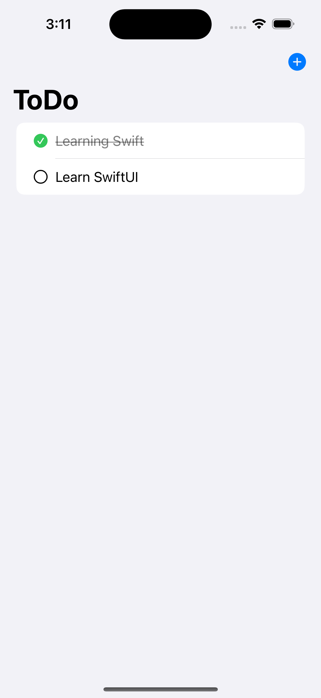
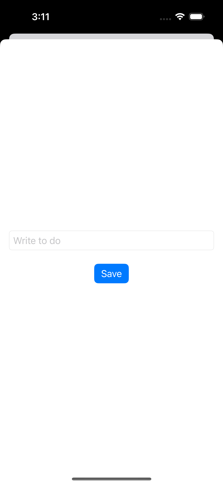

# To Do App  

  

## Overview  

This To-Do app, developed using Swift and SwiftUI, offers a simple and efficient way to manage tasks and stay organized. With a clean and user-friendly interface, the app allows users to create, view, and manage their to-do items effortlessly. Utilizing SwiftData for seamless data management and persistent storage, the app ensures that task information is saved reliably across sessions.
  
## Features  

- **Task Management:** Easily add, edit, and delete tasks with an intuitive interface. Tasks can be marked as complete or incomplete directly from the list, allowing for efficient task tracking and organization.  
- **SwiftData Integration:** Utilizes SwiftData for efficient data handling and storage, ensuring tasks are persisted across app launches. This integration allows for reactive updates to the UI as data changes, providing a dynamic and real-time task management experience.
- **Swipe Actions** Offers convenient swipe actions on each task to quickly mark items as done or not done, streamlining the task management process and enhancing user interactivity.
- **Data Persistence:** Automatically saves changes made to tasks, ensuring that user inputs are consistently maintained, even if the app is closed and reopened.

